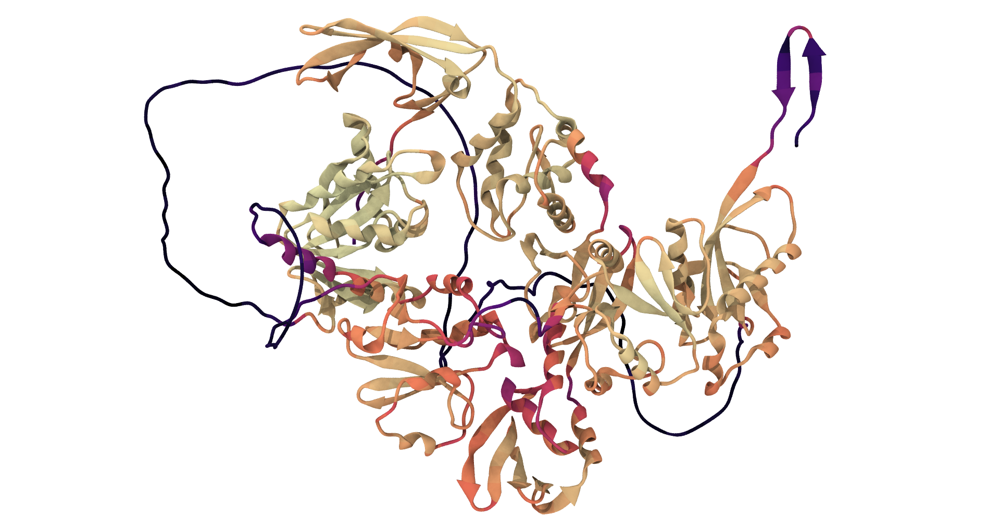
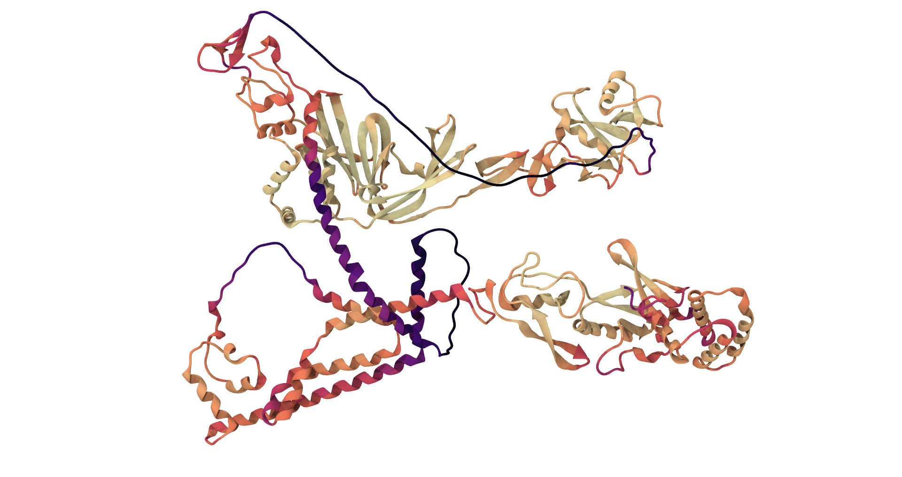
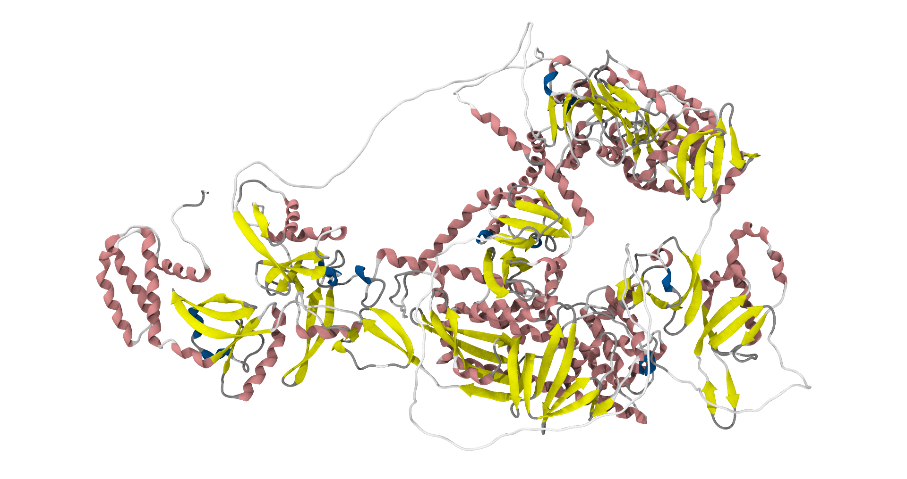
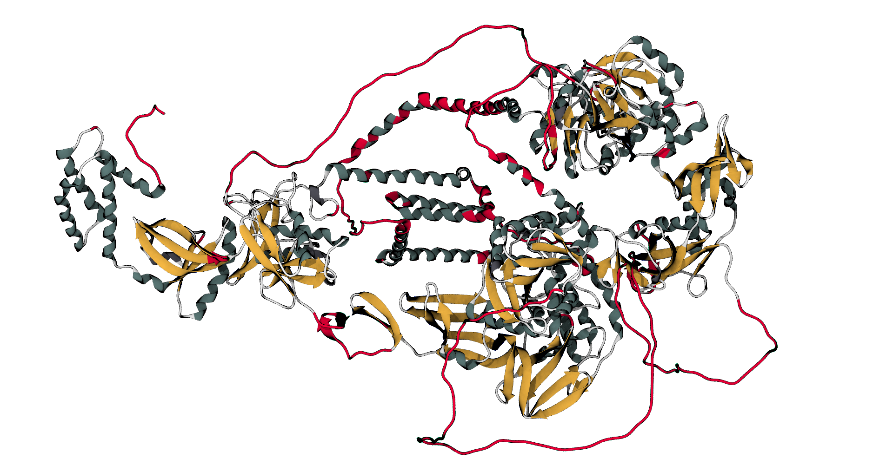

# 🪄 ALPHAFOLD2 RESULTS

**[Main results page is here: ../README.md#-alphafold2-results](../README.md#-alphafold2-results)**

**🕵️‍♂️ Citation :**
- Jumper, J. et al. Highly accurate protein structure prediction with AlphaFold. Nature 596, 583–589 (2021).
- Evans, R. et al. Protein complex prediction with AlphaFold-Multimer. http://biorxiv.org/lookup/doi/10.1101/2021.10.04.463034 (2021) doi:10.1101/2021.10.04.463034.

**🔗 Acces link:** [https://alphafold.ebi.ac.uk/](https://alphafold.ebi.ac.uk/)

## 💻 Method

For doing this modele, we used ColabFold accessible here: [https://github.com/sokrypton/ColabFold](https://github.com/sokrypton/ColabFold). The problem was we are poor and we couldn't use GoogleColab Pro (*sad noises*). Why ? Our protein was to big to be modelled in one shot (not enough RAM). So, we decided to take our sequence and divide it into two parts:
- First 1,000 amino acid **= first part**.
- Last 1,000 amino acid **= second part**.

After, we used MODELLER to re-assemble the two part into one [**(cf. MODELLER part for the general method)**](../MODELLER/README.md).

## 📊 Results

### **Alphafold output:**

**INFERNO COLOUR PALETTE:**
*Low confidence -  - High confidence*

**First part modelled by ALPHAFOLD 2.** Colour palette is inferno.

**Second part modelled by ALPHAFOLD 2.** Colour palette is inferno.

**Full model, after completion with MODELLER.** Colour indicate secondary structure.

There's some loops and some helix that AlphaFold is not confident about. But overall, the model is quite good (even better than our MODELLER model). The only problem is the time and the memory complexity of the model, which led us to use MODELLER instead of using only AlphaFold.

### **Model evaluation:**

**QMEANDisCo:**

**🕵️‍♂️ Citation :** Studer, G., Rempfer, C., Waterhouse, A.M., Gumienny, G., Haas, J., Schwede, T. QMEANDisCo - distance constraints applied on model quality estimation. Bioinformatics 36, 1765-1771 (2020). 

**🔗 Acces link:** [https://swissmodel.expasy.org/qmean/](https://swissmodel.expasy.org/qmean/)

> **QMEANDisCo definition:**
> 
> The default method used by SWISS-MODEL homology modelling pipeline and Structure Assessment - a single model method combining statistical potentials and agreement terms with a distance constraints (DisCo) score. DisCo evaluates consistencies of pairwise CA-CA distances from a model with constraints extracted from homologous structures. All scores are combined using a neural network trained to predict per-residue lDDT scores.

**Model evaluation of the obtain structure.** In red are structure with a `QMEANDisCo local score < 0.5`. Actually, only loops are underline and a helix (with a low confident level output by Alphafold). Overall, the obtain model look good.

By looking with all those results, the model output by Alphafold 2 look to be good to be used for further computation.

**[Main results page is here: ../README.md#-alphafold2-results](../README.md#-alphafold2-results)**
