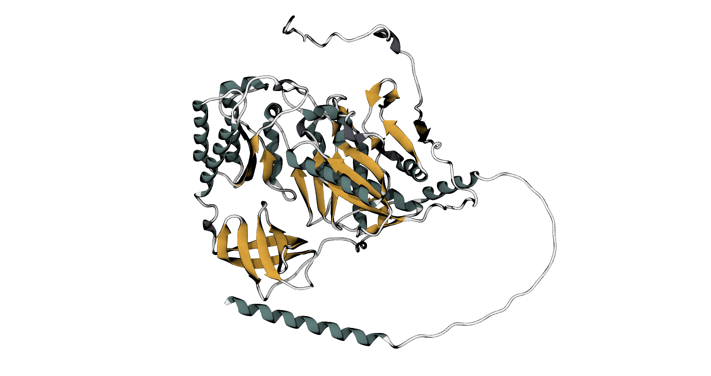
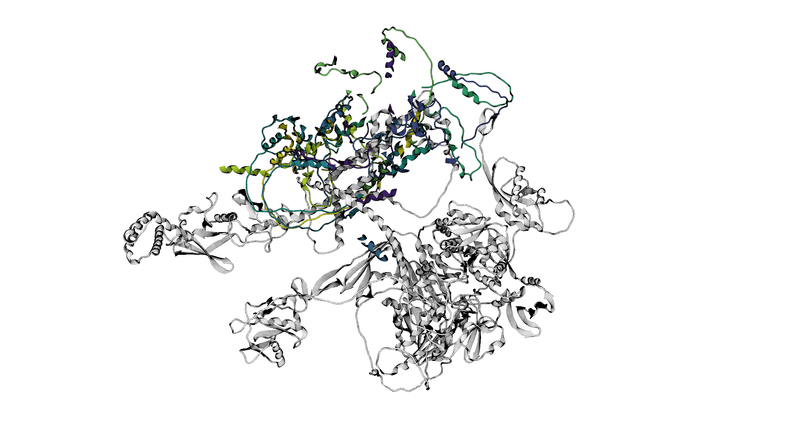
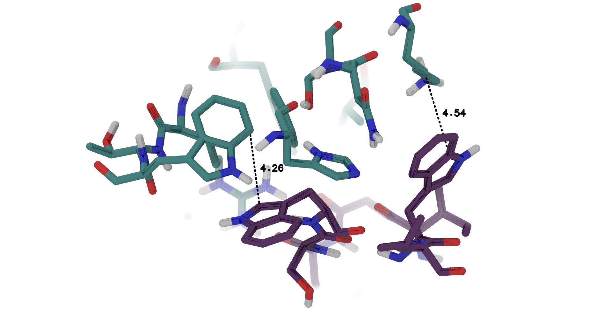

# 🔨 PROTEIN-PROTEIN DOCKING

**[Main results page is here: ../README.md#-protein-protein-docking](../README.md#-protein-protein-docking)**

**🕵️‍♂️ Citation :**
- Desta IT, Porter KA, Xia B, Kozakov D, Vajda S. Performance and Its Limits in Rigid Body Protein-Protein Docking. Structure. 2020 Sep; 28 (9):1071-1081.
- Vajda S, Yueh C, Beglov D, Bohnuud T, Mottarella SE, Xia B, Hall DR, Kozakov D. New additions to the ClusPro server motivated by CAPRI. Proteins: Structure, Function, and Bioinformatics. 2017 Mar; 85(3):435-444.
- Kozakov D, Hall DR, Xia B, Porter KA, Padhorny D, Yueh C, Beglov D, Vajda S. The ClusPro web server for protein-protein docking. Nature Protocols. 2017 Feb;12(2):255-278.
- Kozakov D, Beglov D, Bohnuud T, Mottarella S, Xia B, Hall DR, Vajda, S. How good is automated protein docking? Proteins: Structure, Function, and Bioinformatics. 2013 Dec; 81(12):2159-66.

**🔗 Acces link:** [https://cluspro.bu.edu/](https://cluspro.bu.edu/)

## 💻 Method

We used our protein as a receptor and this next protein, CDKAL1, as a ligand:

**Cartoon representation of CDKAL1.**

Then we selected our protein is function of a `balanced` classification, which considerate `electrostatic-favored`, `hydrophobic-favored` and `VdW` interactions. Else, all options have been left as default.

## 📊 Results

**Results of the protein-protein docking.** Each color indicates a different pose. Actually, all protein are docked in the same region, showing that the interacting zone is quite good/interesting.

**First part of observe results after protein-protein docking.** Here, two hydrophobic interaction are underline. Here, only residues with a distance of 5 Å are shown between the two docked protein.

**First part of observe results after protein-protein docking.** Here, three hydrophobic interaction are underline, but note that there is other type of interaction. Here, only residues with a distance of 5 Å are shown between the two docked protein.

Here two major points are notable:
1. The 10 best docking position are in the same localisation, showing that this localisation is a potential interaction area.
2. For the best docking position, a majority of the observed interactions are hydrophobic ones. This could lead to a problem that those part are, actually, expose to the solvant.

**[Main results page is here: ../README.md#-protein-protein-docking](../README.md#-protein-protein-docking)**
