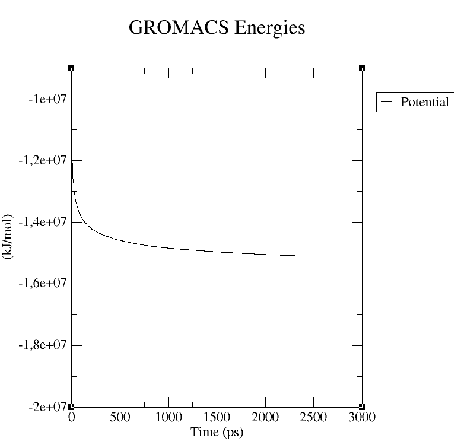

# 🎥 GROMACS

**[Main results page is here: ../README.md#-molecular-dynamic-simulations](../README.md#-molecular-dynamic-simulations)**

**🕵️‍♂️ Citation :** Bauer, P., Hess, B. & Lindahl, E. GROMACS 2022.1 Manual. (2022) doi:10.5281/ZENODO.6451567.


**🔗 Acces link:** [https://www.gromacs.org/](https://www.gromacs.org/)

**Software version, obtain with `gmx --version`:**
```bash
GROMACS version:    2022
Precision:          mixed
Memory model:       64 bit
MPI library:        thread_mpi
OpenMP support:     enabled (GMX_OPENMP_MAX_THREADS = 128)
GPU support:        disabled
SIMD instructions:  SSE4.1
CPU FFT library:    fftw-3.3.8-sse2
GPU FFT library:    none
RDTSCP usage:       enabled
TNG support:        enabled
Hwloc support:      disabled
Tracing support:    disabled
C compiler:         /usr/bin/gcc GNU 9.3.0
C compiler flags:   -msse4.1 -pthread -Wno-missing-field-initializers -fexcess-precision=fast -funroll-all-loops -O3 -DNDEBUG
C++ compiler:       /usr/bin/c++ GNU 9.3.0
C++ compiler flags: -msse4.1 -pthread -Wno-missing-field-initializers -fexcess-precision=fast -funroll-all-loops -fopenmp -O3 -DNDEBUG
```

## 💻 Method

### Topology generation

```bash
# Convert a `.pdb` to a `.gro` file.
gmx pdb2gmx -f ../ALPHAFOLD/BEST_MODEL.pdb -o P0DTC1.gro
```

Select force fild:
- CHARMM27 all-atom force field (CHARM22 plus CMAP for proteins)

Select water model:
- TIP3P   TIP 3-point, recommended

### Defining box

```bash
# Adding a box for periodic conditions.
gmx editconf -f P0DTC1.gro -o box.gro -c -d 1.0 -bt cubic
```

### Solvating the protein

```bash
# Adding waters.
gmx solvate -cp box.gro -cs spc216.gro -o solvant.gro -p topol.top
```

### Ions addition

```bash
# Generate a file to add ions.
gmx grompp -f ions.mdp -c solvant.gro -p topol.top -o ions.tpr
# Adding ions (neutralize all charges).
gmx genion -s ions.tpr -o ions.gro -p topol.top -pname NA -nname CL -neutral
```

### Minimization of the system

**Steepest descent minimization:**

```bash
# Generate a file to do the minimization.
gmx grompp -f minim_steep.mdp -c ions.gro -p topol.top -o steep.tpr
# Run the minimization.
gmx mdrun -v -deffnm steep
# Check energy graph.
gmx energy -f steep.edr -o steep.xvg
```

**Conjugated gradient minimization:**

```bash
# Generate a file to do the minimization.
gmx grompp -f minim_cg.mdp -c steep.gro -p topol.top -o cg.tpr
# Run the minimization.
gmx mdrun -v -deffnm cg
# Check energy graph.
gmx energy -f cg.edr -o cg.xvg
```

### Equilibration

**Equilibration to NVT:**

```bash
# Generate a file to do the NVT equilibration.
gmx grompp -f nvt.mdp -c em.gro -r em.gro -p topol.top -o nvt.tpr
# Run the NVT equilibration.
gmx mdrun -deffnm nvt
# Check temperature graph.
gmx energy -f nvt.edr -o nvt.xvg
```

**Equilibration to NPT:**

```bash
# Generate a file to do the NPT equilibration.
gmx grompp -f npt.mdp -c nvt.gro -r nvt.gro -t nvt.cpt -p topol.top -o npt.tpr
# Run the NPT equilibration.
gmx mdrun -deffnm npt
# Check pression, density and temperature graph.
gmx energy -f npt.edr -o npt.xvg
```

### Production

```bash
# Generate a file to do the production.
gmx grompp -f md.mdp -c npt.gro -t npt.cpt -p topol.top -o md.tpr
# Run the production.
gmx mdrun -deffnm md
# Check pression, density and temperature graph.
gmx energy -f md.edr -o md.xvg
```

## 📊 Results

### **Système minimization**

**With using the steepest descent algorithm to do the minimization:**



**Plot of the dimunution of the potential energy.** Here, there is a good minimisation of the system.

**With using the conjugated gradient algorithm to do the minimization:** There is not plot to show, as far as there is only one value that have been computed *(see below)*.

| **Temps (en ps)** | **Énergie potentielle (kJ/mol)** |
| :---------------: | :------------------------------: |
|     0.000000      |         -15095363.000000         |
|     0.000000      |         -15095728.000000         |

**[Main results page is here: ../README.md#-molecular-dynamic-simulations](../README.md#-molecular-dynamic-simulations)**
