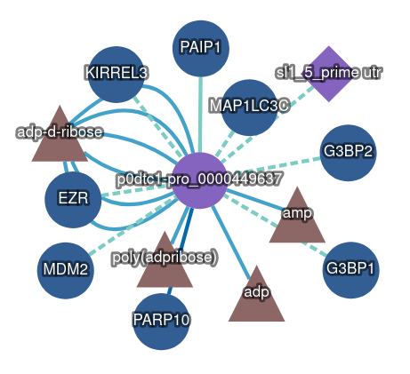

# 🪢 INTACT

**[Main results page is here: ../README.md#-intact-database](../README.md#-intact-database)**

**🕵️‍♂️ Citation :** Orchard S, et al. (2013) The MIntAct project - IntAct as a common curation platform for 11 molecular interaction databases. Nucleic Acids Research, 42(Database issue):D358-63, 13 Nov 2013, PMID: 24234451

**🔗 Acces link:** [https://www.ebi.ac.uk/intact/search?query=id:P0DTC1*&expanded=true#interactor](https://www.ebi.ac.uk/intact/search?query=id:P0DTC1*&expanded=true#interactor)

## 📊 Results

**Three INTACT results cluster.** All of those proteins interact with our protein of interest. *Blue= Homo sapiens*; *brown=* chemical synthesis; *purple=* other viruses; *triangle=* bioactive entity; *circle=* protein; *diamond=* ARN.

By checking the INTACT databse, we can see that our protein does interact with other proteins. There is three cluster identified. This cluster have been choosed as far as there's only interaction between our protein and other from *Homo sapiens*. For the docking protein-protein analysis, we will work with:
- CDKAL1.
- On UNIPROT: [Q5VV42](https://www.uniprot.org/uniprotkb/Q5VV42/).
- Reasons:
  1. There is structural information.
  2. This protein interact with our protein of interest.

**[Main results page is here: ../README.md#-intact-database](../README.md#-intact-database)**
