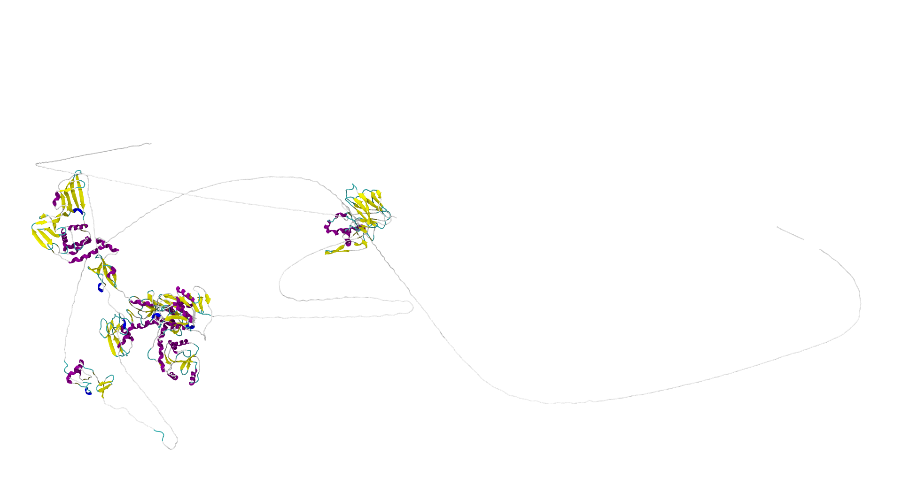

# 🖇 MODELLER RESULTS

**[Main results page is here: ../README.md#-modeller](../README.md#-modeller-results)**

**🕵️‍♂️ Citation :** Webb, B. & Sali, A. Comparative Protein Structure Modeling Using MODELLER. Current Protocols in Bioinformatics 54, (2016).

**🔗 Access link:** [https://salilab.org/modeller/](https://salilab.org/modeller/)

## 💻 Method

First, we extract all PDB code using NCBI's BLAST-P ([**check the main README file**](../README.md#-blast-p-results)). Then we used **Clustal OMEGA** to align all of the obtain sequences:
- **🕵️‍♂️ Citation :**  Madeira F, Pearce M, Tivey ARN, et al. Search and sequence analysis tools services from EMBL-EBI in 2022. Nucleic Acids Research. 2022 Apr:gkac240. DOI: 10.1093/nar/gkac240. PMID: 35412617; PMCID: PMC9252731. 
- **🔗 Access link:** [https://www.ebi.ac.uk/Tools/msa/clustalo/](https://www.ebi.ac.uk/Tools/msa/clustalo/)

> **📝 NOTE** 
> 
> Some part of the structure, if they are too flexible, will not be resolved in the PDB structure. **BUT**, the sequence will still be the same. To get ride of the not resolved residues into the `.fasta` sequence, we use PYMOL:
> - **🕵️‍♂️ Citation :**  Schrödinger, LLC. The PyMOL molecular graphics system, version 1.8. (2015).
> - **🔗 Access link:** [https://pymol.org/2/](https://pymol.org/2/)

After the alignement is done, we index correctly the sequences to match MODELLER expectation (check `align.ali`). Then we used the python file to launch MODELLER. We check the produce log file, `alignementDHH.log` to see the best model.

## 📊 Results

**The best model that MODELLER succeded to produce.** Obviously, it's bad, there is too much random coil.

| **PDB access code** | **RMSD (Å)** |
| :-----------------: | :----------: |
|        2KQV         |      1       |
|        2W2G         |      1       |
|        4XW3         |      23      |
|        6WOJ         |     0.8      |
|        6WUU         |      4       |
|        7KAG         |      2       |
|        7LGO         |      4       |
|        7T9W         |      4       |
|        7THH         |      11      |

In this upper table, we can see five RMSD values > to 3 Å, and two pf them being very high. This show that MODELLER didn't succed to model our protein. The high amount of random coiled and the production of a almost linear protein show that this obtain model is bad.

**[Main results page is here: ../README.md#-modeller](../README.md#-modeller-results)**

