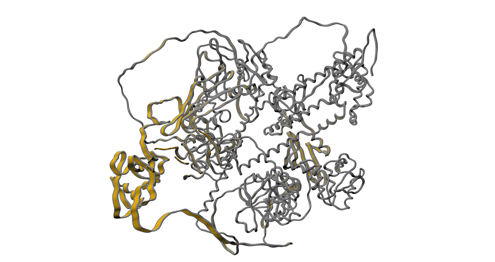
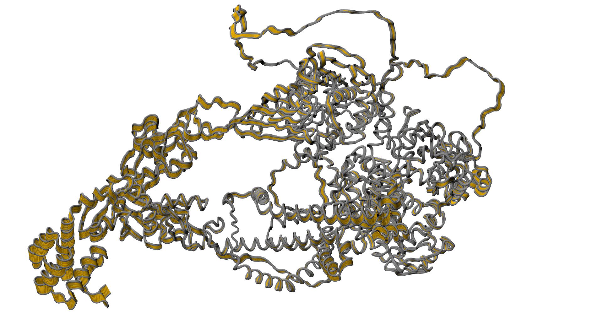
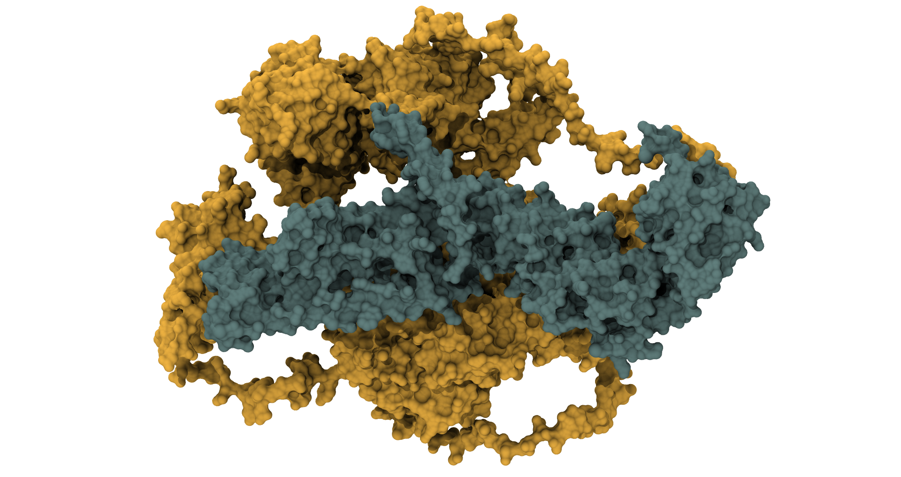

# 🔬 STUDY OF THE NORMAL MODES

**[Main results page is here: ../README.md#-study-of-the-normal-modes](../README.md#-study-of-the-normal-modes)**

**🕵️‍♂️ Citation :**
- Suhre K, Navaza J, and Sanejouand YH, NORMA: a tool for flexible fitting of high resolution protein structures into low resolution electron microscopy derived density maps, Acta Cryst. D, 62(9), p1098-1100, 2006.
- Suhre, K. & Sanejouand, Y.H., ElNemo: a normal mode web-server for protein movement analysis and the generation of templates for molecular replacement. Nucleic Acids Research, 32, W610-W614, 2004.
- Suhre, K. & Sanejouand, Y.H., On the potential of normal mode analysis for solving difficult molecular replacement problems. Acta Cryst. D vol.60, p796-799, 2004.
- Valadie, H., Lacapere, J. J., Sanejouand, Y.H. & Etchebest, C., Dynamical properties of the MscL of Escherichia coli: a normal mode analysis. J. Mol. Biol. vol.332, p657-674, 2003.
- Delarue, M. & Sanejouand, Y.H., Simplified normal mode analysis of conformational transitions in DNA-dependant polymerases: the Elastic Network Model. J. Mol. Biol. vol.320, p1011-1024, 2002.
- Tama, F. & Sanejouand, Y.H., Conformational change of proteins arising from normal mode calculations. Protein Engineering vol.14, p1-6, 2001.
- Tama, F., Gadea, F.X., Marques, O. & Sanejouand, Y.H., Building-block approach for determining low-frequency normal modes of macromolecules. Proteins: Structure, Function and Genetics vol.41, p1-7, 2000.
- Durand, P., Trinquier, G., & Sanejouand, Y.H., A new approach for determining low-frequency normal modes in macromolecules. Biopolymers vol.34, p759, 1994.

**🔗 Acces link:** [http://www.sciences.univ-nantes.fr/elnemo/](http://www.sciences.univ-nantes.fr/elnemo/)

## 💻 Method

We simply submit out Alphafold model on the website, without changing anything.

## 📊 Results

> **📝 NOTE** 
> 
> The accordion represention is something that we came up with. To show a movement on a fixed picture, in molecular dynamic simulation we show a superposition of multiple frames. The problem here is that the movement is too light to be observed like this. So, in order to highlight the flexible part, we used VMD as follow:
> 1. In a thick gray ribbon, showing first and last frames.
> 2. In a thin orange ribbon, showing all frames.
>
> To interpretate this figure, this is quite simple:
> - No movement = superposition of last and first frames = only the gray ribbon are observable.
> - Very flexible part = all frames are distinguishable and not superimposed = orange part are very visible.
>
> **It's like an accordion we open or closed, but with movement compute by the normal mode. The grip part (or housing) correspond to the gray ribbon. The middle part (or bellows) correspond to the orange ribbon.**

**Represention in accordion of the 7th normal mode compute.** The observe movement are a tilt movement of the left part.

**Represention in accordion of the 8th normal mode compute.** The observe movement are rotation of two lobes independently, following a same axix. The lobes are define in the next figure.

**Definition of the two lob.**

Here, we can observe that the two principal movement are due to a big middle alpha helix. Nevertheless, this is quite a problem as far as Alphafold isn't confident about it and the QMEANDisCo score is low on this part. We need to link those results with the molecular dynamic simulation to a better understanding of those movements.

**[Main results page is here: ../README.md#-study-of-the-normal-modes](../README.md#-study-of-the-normal-modes)**
