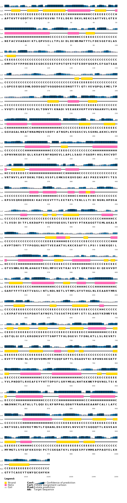
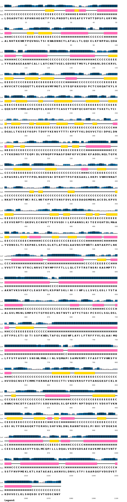

# PSIPRED RESULTS

**Citation :**
- Jones DT. (1999) Protein secondary structure prediction based on position-specific scoring matrices. J. Mol. Biol. 292: 195-202.
- Buchan DWA, Jones DT (2019). The PSIPRED Protein Analysis Workbench: 20 years on. Nucleic Acids Research. https://doi.org/10.1093/nar/gkz297

**Acces link:** [http://bioinf.cs.ucl.ac.uk/psipred/](http://bioinf.cs.ucl.ac.uk/psipred/)

## Method

Actually, the PSIPRED workbench have a limit size of publication. So, to get around this problem, we cut the sequence into two parts. This have a down side : we have to double the analysis to verify if the secondary sequence predicted do not change significantly (due to a context phenomena).

## Results

### PSIPRED CARTOON : First half

### PSIPRED CARTOON : Second half

### Global analysis

