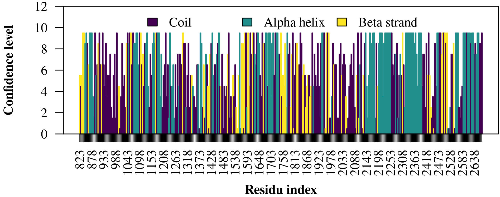

# 🔮 PSIPRED RESULTS

**🕵️‍♂️ Citation :**
- Jones DT. (1999) Protein secondary structure prediction based on position-specific scoring matrices. J. Mol. Biol. 292: 195-202.
- Buchan DWA, Jones DT (2019). The PSIPRED Protein Analysis Workbench: 20 years on. Nucleic Acids Research. https://doi.org/10.1093/nar/gkz297

**🔗 Acces link:** [http://bioinf.cs.ucl.ac.uk/psipred/](http://bioinf.cs.ucl.ac.uk/psipred/)

## 💻 Method

Actually, the PSIPRED workbench have a limit size of publication. So, to get around this problem, we cut the sequence into two parts. This have a down side : we have to double the analysis to verify if the secondary sequence predicted do not change significantly (due to a context phenomena).

## 📊 Results

All results in `psipred.horiz` have been translated to obtain a `psipred.csv` with those codes:

| **Number** | **Letter code** | **Meaning** |
| :--------: | :-------------: | :---------- |
|     0      |        C        | Coil        |
|     1      |        H        | Alpha helix |
|     2      |        E        | Beta strand |

> **📝 NOTE** 
> 
> On the first line of `psipred.csv` we have the secondary structure predicted, while on the second line we have the associated confidence level.

 **PSIPRED prediction results on the domain of interest.**</strong>** The resolution is set at 5 (printing only `% 5 == 0` residu index). The confidence level given here is the same as PSIPRED `+ 0.5`.

For general analysis, we can see that there are two alpha helix with high confidence level (approximatively 2148-2248 and 2323-2398). In general, all part with coil are predicted with a lower confidence level than the rest.
