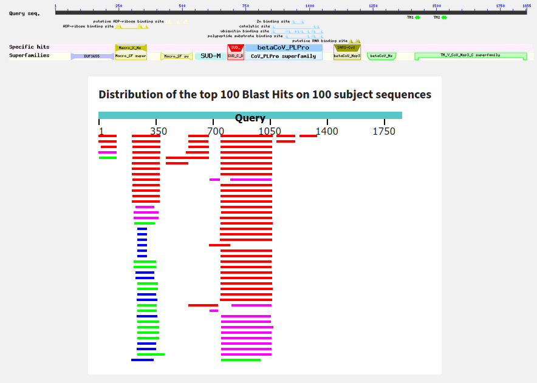
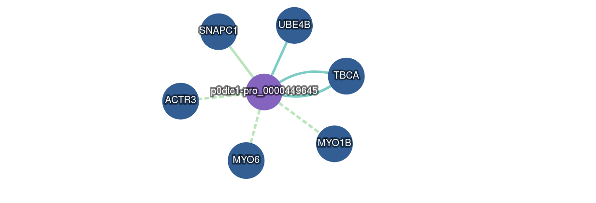

# 🧬 STRUCTURAL PROJECT 🤓

[](https://github.com/FilouPlains/STRUCTURAL_PROJECT)


**✍️ Authors:** BELAKTIB Anas - ROUAUD Lucas

Master 2 Bio-informatics at Univerité de Paris

## 📂 Interesting path

- 

## 🧐 Context

This project have do be done for our cursus of master degrees. More precisely, for our class of structural bioinformatics. Here, we have the next protein (**UNIPROT code = P0DTC1**):
```fasta
>sp|P0DTC1|R1A_SARS2 Replicase polyprotein 1a OS=Severe acute respiratory syndrome coronavirus 2 OX=2697049 PE=1 SV=1
APTKVTFGDDTVIEVQGYKSVNITFELDERIDKVLNEKCSAYTVELGTEVNEFACVVADA
VIKTLQPVSELLTPLGIDLDEWSMATYYLFDESGEFKLASHMYCSFYPPDEDEEEGDCEE
EEFEPSTQYEYGTEDDYQGKPLEFGATSAALQPEEEQEEDWLDDDSQQTVGQQDGSEDNQ
TTTIQTIVEVQPQLEMELTPVVQTIEVNSFSGYLKLTDNVYIKNADIVEEAKKVKPTVVV
NAANVYLKHGGGVAGALNKATNNAMQVESDDYIATNGPLKVGGSCVLSGHNLAKHCLHVV
GPNVNKGEDIQLLKSAYENFNQHEVLLAPLLSAGIFGADPIHSLRVCVDTVRTNVYLAVF
DKNLYDKLVSSFLEMKSEKQVEQKIAEIPKEEVKPFITESKPSVEQRKQDDKKIKACVEE
VTTTLEETKFLTENLLLYIDINGNLHPDSATLVSDIDITFLKKDAPYIVGDVVQEGVLTA
VVIPTKKAGGTTEMLAKALRKVPTDNYITTYPGQGLNGYTVEEAKTVLKKCKSAFYILPS
IISNEKQEILGTVSWNLREMLAHAEETRKLMPVCVETKAIVSTIQRKYKGIKIQEGVVDY
GARFYFYTSKTTVASLINTLNDLNETLVTMPLGYVTHGLNLEEAARYMRSLKVPATVSVS
SPDAVTAYNGYLTSSSKTPEEHFIETISLAGSYKDWSYSGQSTQLGIEFLKRGDKSVYYT
SNPTTFHLDGEVITFDNLKTLLSLREVRTIKVFTTVDNINLHTQVVDMSMTYGQQFGPTY
LDGADVTKIKPHNSHEGKTFYVLPNDDTLRVEAFEYYHTTDPSFLGRYMSALNHTKKWKY
PQVNGLTSIKWADNNCYLATALLTLQQIELKFNPPALQDAYYRARAGEAANFCALILAYC
NKTVGELGDVRETMSYLFQHANLDSCKRVLNVVCKTCGQQQTTLKGVEAVMYMGTLSYEQ
FKKGVQIPCTCGKQATKYLVQQESPFVMMSAPPAQYELKHGTFTCASEYTGNYQCGHYKH
ITSKETLYCIDGALLTKSSEYKGPITDVFYKENSYTTTIKPVTYKLDGVVCTEIDPKLDN
YYKKDNSYFTEQPIDLVPNQPYPNASFDNFKFVCDNIKFADDLNQLTGYKKPASRELKVT
FFPDLNGDVVAIDYKHYTPSFKKGAKLLHKPIVWHVNNATNKATYKPNTWCIRCLWSTKP
VETSNSFDVLKSEDAQGMDNLACEDLKPVSEEVVENPTIQKDVLECNVKTTEVVGDIILK
PANNSLKITEEVGHTDLMAAYVDNSSLTIKKPNELSRVLGLKTLATHGLAAVNSVPWDTI
ANYAKPFLNKVVSTTTNIVTRCLNRVCTNYMPYFFTLLLQLCTFTRSTNSRIKASMPTTI
AKNTVKSVGKFCLEASFNYLKSPNFSKLINIIIWFLLLSVCLGSLIYSTAALGVLMSNLG
MPSYCTGYREGYLNSTNVTIATYCTGSIPCSVCLSGLDSLDTYPSLETIQITISSFKWDL
TAFGLVAEWFLAYILFTRFFYVLGLAAIMQLFFSYFAVHFISNSWLMWLIINLVQMAPIS
AMVRMYIFFASFYYVWKSYVHVVDGCNSSTCMMCYKRNRATRVECTTIVNGVRRSFYVYA
NGGKGFCKLHNWNCVNCDTFCAGSTFISDEVARDLSLQFKRPINPTDQSSYIVDSVTVKN
GSIHLYFDKAGQKTYERHSLSHFVNLDNLRANNTKGSLPINVIVFDGKSKCEESSAKSAS
VYYSQLMCQPILLLDQALVSDVGDSAEVAVKMFDAYVNTFSSTFNVPMEKLKTLVATAEA
ELAKNVSLDNVLSTFISAARQGFVDSDVETKDVVECLKLSHQSDIEVTGDSCNNY
```

> **📝 NOTE** 
> 
> We only interested of the 819-2763 region. Note that can influence some results, like Alphafold prediction. We will not take those in consideration (even though that's bad, but clock ticking ⏱).


With this sequence, three operations will be performed:

1. Searching for structural (and sequence) informations.
2. Doing molecular dynamic simulations.
3. Doing protein-protein docking.

This repository is much likely a way to keep track of all jobs that are going to be done. There's not going to be be program (maybe for results analysis).


## 🧪 Sequence and structural informations

### BLAST-P results

**🕵️‍♂️ Citation :** Mark Johnson, Irena Zaretskaya, Yan Raytselis, Yuri Merezhuk, Scott McGinnis, Thomas L. Madden, NCBI BLAST: a better web interface, Nucleic Acids Research, Volume 36, Issue suppl_2, 1 July 2008, Pages W5–W9, https://doi.org/10.1093/nar/gkn201 

**🔗 Acces link:** (https://blast.ncbi.nlm.nih.gov/Blast.cgi?PAGE=Proteins)[https://blast.ncbi.nlm.nih.gov/Blast.cgi?PAGE=Proteins]


Launching a BLAST-P show us that the proteins with high coverage percentage and identity rate are from viruses. The results have not been showed here, as far as there are not very informative.


**NCBI graphical summary.** Here, we can see that a good proportion of our protein is well covered.

By using NCBI's BLAST-P program, we can see that the 3/4 of the protein does have a structural information with good identity rate. But the end part does not (and we found we PSIPRED that those part should contain helix). Some additional analysis could be done:
- Checking the secondary structure of those PDB: are they the same?
- Compare them to PSIPRED results: are they the same?
- Is obtain alignments **REALLY** have structural information? Because NCBI align on the structure FASTA, but not on the real determine residues.


## INTACT database

**🕵️‍♂️ Citation :** Orchard S, et al. (2013) The MIntAct project - IntAct as a common curation platform for 11 molecular interaction databases. Nucleic Acids Research, 42(Database issue):D358-63, 13 Nov 2013, PMID: 24234451

**🔗 Acces link:** (https://www.ebi.ac.uk/intact/search?query=id:P0DTC1*&expanded=true#interactor)[https://www.ebi.ac.uk/intact/search?query=id:P0DTC1*&expanded=true#interactor]


**On of the three INTACT results cluster.**

By checking the INTACT databse, we can see that our protein does interact with other proteins. There is three cluster identified. This cluster have been choosed as far as there's only interaction between our protein and other from *Homo sapiens*. Those partners have to be analysed.

## 📐 Molecular dynamic simulations

### Study of the normal modes


### Molecular dynamic simulations

For this purpose, we are going to use the software GROMACS in all-atoms.

## 🔨 Protein-protein docking

## 📜 Conclusion
