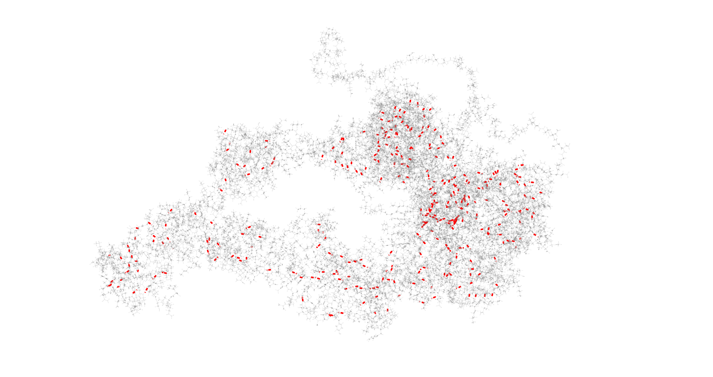

# 🧬 STRUCTURAL PROJECT 🤓

[](https://github.com/FilouPlains/STRUCTURAL_PROJECT)


**✍️ Authors:** BELAKTIB Anas - ROUAUD Lucas

Master 2 Bio-informatics at Univerité de Paris

## 📂 Interesting path

- 

## 🧐 Context

This project have do be done for our cursus of master degrees. More precisely, for our class of structural bioinformatics. Here, we have the next protein ([**UNIPROT code = P0DTC1**](https://www.uniprot.org/uniprotkb/P0DTC1/entry)):
```fasta
>sp|P0DTC1|R1A_SARS2 Replicase polyprotein 1a OS=Severe acute respiratory syndrome coronavirus 2 OX=2697049 PE=1 SV=1
APTKVTFGDDTVIEVQGYKSVNITFELDERIDKVLNEKCSAYTVELGTEVNEFACVVADA
VIKTLQPVSELLTPLGIDLDEWSMATYYLFDESGEFKLASHMYCSFYPPDEDEEEGDCEE
EEFEPSTQYEYGTEDDYQGKPLEFGATSAALQPEEEQEEDWLDDDSQQTVGQQDGSEDNQ
TTTIQTIVEVQPQLEMELTPVVQTIEVNSFSGYLKLTDNVYIKNADIVEEAKKVKPTVVV
NAANVYLKHGGGVAGALNKATNNAMQVESDDYIATNGPLKVGGSCVLSGHNLAKHCLHVV
GPNVNKGEDIQLLKSAYENFNQHEVLLAPLLSAGIFGADPIHSLRVCVDTVRTNVYLAVF
DKNLYDKLVSSFLEMKSEKQVEQKIAEIPKEEVKPFITESKPSVEQRKQDDKKIKACVEE
VTTTLEETKFLTENLLLYIDINGNLHPDSATLVSDIDITFLKKDAPYIVGDVVQEGVLTA
VVIPTKKAGGTTEMLAKALRKVPTDNYITTYPGQGLNGYTVEEAKTVLKKCKSAFYILPS
IISNEKQEILGTVSWNLREMLAHAEETRKLMPVCVETKAIVSTIQRKYKGIKIQEGVVDY
GARFYFYTSKTTVASLINTLNDLNETLVTMPLGYVTHGLNLEEAARYMRSLKVPATVSVS
SPDAVTAYNGYLTSSSKTPEEHFIETISLAGSYKDWSYSGQSTQLGIEFLKRGDKSVYYT
SNPTTFHLDGEVITFDNLKTLLSLREVRTIKVFTTVDNINLHTQVVDMSMTYGQQFGPTY
LDGADVTKIKPHNSHEGKTFYVLPNDDTLRVEAFEYYHTTDPSFLGRYMSALNHTKKWKY
PQVNGLTSIKWADNNCYLATALLTLQQIELKFNPPALQDAYYRARAGEAANFCALILAYC
NKTVGELGDVRETMSYLFQHANLDSCKRVLNVVCKTCGQQQTTLKGVEAVMYMGTLSYEQ
FKKGVQIPCTCGKQATKYLVQQESPFVMMSAPPAQYELKHGTFTCASEYTGNYQCGHYKH
ITSKETLYCIDGALLTKSSEYKGPITDVFYKENSYTTTIKPVTYKLDGVVCTEIDPKLDN
YYKKDNSYFTEQPIDLVPNQPYPNASFDNFKFVCDNIKFADDLNQLTGYKKPASRELKVT
FFPDLNGDVVAIDYKHYTPSFKKGAKLLHKPIVWHVNNATNKATYKPNTWCIRCLWSTKP
VETSNSFDVLKSEDAQGMDNLACEDLKPVSEEVVENPTIQKDVLECNVKTTEVVGDIILK
PANNSLKITEEVGHTDLMAAYVDNSSLTIKKPNELSRVLGLKTLATHGLAAVNSVPWDTI
ANYAKPFLNKVVSTTTNIVTRCLNRVCTNYMPYFFTLLLQLCTFTRSTNSRIKASMPTTI
AKNTVKSVGKFCLEASFNYLKSPNFSKLINIIIWFLLLSVCLGSLIYSTAALGVLMSNLG
MPSYCTGYREGYLNSTNVTIATYCTGSIPCSVCLSGLDSLDTYPSLETIQITISSFKWDL
TAFGLVAEWFLAYILFTRFFYVLGLAAIMQLFFSYFAVHFISNSWLMWLIINLVQMAPIS
AMVRMYIFFASFYYVWKSYVHVVDGCNSSTCMMCYKRNRATRVECTTIVNGVRRSFYVYA
NGGKGFCKLHNWNCVNCDTFCAGSTFISDEVARDLSLQFKRPINPTDQSSYIVDSVTVKN
GSIHLYFDKAGQKTYERHSLSHFVNLDNLRANNTKGSLPINVIVFDGKSKCEESSAKSAS
VYYSQLMCQPILLLDQALVSDVGDSAEVAVKMFDAYVNTFSSTFNVPMEKLKTLVATAEA
ELAKNVSLDNVLSTFISAARQGFVDSDVETKDVVECLKLSHQSDIEVTGDSCNNY
```

> **📝 NOTE** 
> 
> We only interested of the 819-2763 region. Note that can influence some results, like Alphafold prediction. We will not take those in consideration (even though that's bad, but clock ticking ⏱).


With this sequence, three operations will be performed:

1. Searching for structural (and sequence) informations.
2. Doing molecular dynamic simulations.
3. Doing protein-protein docking.

This repository is much likely a way to keep track of all jobs that are going to be done. There's not going to be be program (maybe for results analysis).


## 🧪 Sequence and structural informations

### 🚃 BLAST-P results

**🕵️‍♂️ Citation :** Mark Johnson, Irena Zaretskaya, Yan Raytselis, Yuri Merezhuk, Scott McGinnis, Thomas L. Madden, NCBI BLAST: a better web interface, Nucleic Acids Research, Volume 36, Issue suppl_2, 1 July 2008, Pages W5–W9, https://doi.org/10.1093/nar/gkn201 

**🔗 Acces link:** [https://blast.ncbi.nlm.nih.gov/Blast.cgi?PAGE=Proteins](https://blast.ncbi.nlm.nih.gov/Blast.cgi?PAGE=Proteins)


Launching a BLAST-P show us that the proteins with high coverage percentage and identity rate are from viruses. The results have not been showed here, as far as there are not very informative.


**NCBI graphical summary.** Here, we can see that a good proportion of our protein is well covered.

By using NCBI's BLAST-P program, we can see that the 3/4 of the protein does have a structural information with good identity rate. But the end part does not (and we found we PSIPRED that those part should contain helix). Some additional analysis could be done:
- Checking the secondary structure of those PDB: are they the same?
- Compare them to PSIPRED results: are they the same?
- Is obtain alignments **REALLY** have structural information? Because NCBI align on the structure FASTA, but not on the real determine residues.

### 🔮 PSIPRED results

**[Results are described here: PSIPRED/README.md](PSIPRED/README.md)**

### 🪄 ALPHAFOLD2 results

**[Results are described here: ALPHAFOLD/README.md](ALPHAFOLD/README.md)**

### 🖇 MODELLER results

**[Results are described here: MODELLER/README.md](MODELLER/README.md)**

## 🪢 INTACT database

**[Results are described here: INTACT/README.md](INTACT/README.md)**

## 📐 Molecular dynamic simulations

### 🔬 Study of the normal modes

### 🌡 H++

**🕵️‍♂️ Citation :**
- Ramu Anandakrishnan, Boris Aguilar and Alexey V. Onufriev, "H++ 3.0: automating pK prediction and the preparation of biomolecular structures for atomistic molecular modeling and simulation", Nucleic Acids Res., 40(W1):W537-541. (2012).
- Myers J, Grothaus G, Narayanan S, Onufriev A, "A simple clustering algorithm can be accurate enough for use in calculations of pKs in macromolecules", Proteins, 63, 928-938 (2006).
- Gordon JC, Myers JB, Folta T, Shoja V, Heath LS and Onufriev A., "H++: a server for estimating pKas and adding missing hydrogens to macromolecules", Nucleic Acids Res. Jul 1;33:W368-71. (2005). 

**🔗 Acces link:** [http://newbiophysics.cs.vt.edu/H++/](http://newbiophysics.cs.vt.edu/H++/)

We used H++ to protonate our structure. Like so, we can considerate the external influence of the solvant and the internal influence of other amino acids.


**Our obtain structure.** In red are the h-bonds compute by VMD.

### 🎥 Molecular dynamic simulations

For this purpose, we are going to use the software GROMACS in all-atoms.

**[Results and methods are described here: GROMACS/README.md](GROMACS/README.md)**

## 🔨 Protein-protein docking

## 📜 Conclusion
